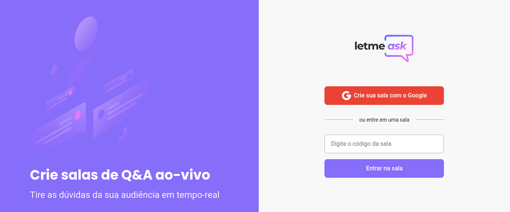
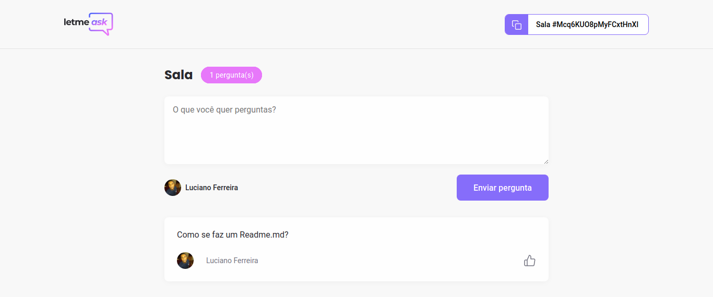

<h1 align="center">
    
</h1>

  <a href="#-tecnologias">Tecnologias</a>&nbsp;&nbsp;&nbsp;|&nbsp;&nbsp;&nbsp;
  <a href="#-projeto">Projeto</a>&nbsp;&nbsp;&nbsp;|&nbsp;&nbsp;&nbsp;
  <a href="#-layout">Layout</a>

 

## 🚀 Tecnologias

Esse projeto foi desenvolvido com as seguintes tecnologias:

- [React](https://reactjs.org)
- [TypeScript](https://www.typescriptlang.org/)
- [Firebase](https://firebase.google.com/)

## 💻 Projeto

O Letmeask é uma aplicação que serve como elo entre mentor e aluno para tirar dúvidas, tornando-se assim indespensável para você que esta em processo de aprendizado e também para você que está em processo de passar seu conhecimento adiante.

## 🔖 Layout

<h1 align="center">
    
</h1>
<h1 align="center">
    
</h1>

Feito por Luciano Ferreira
Rocketseat 
